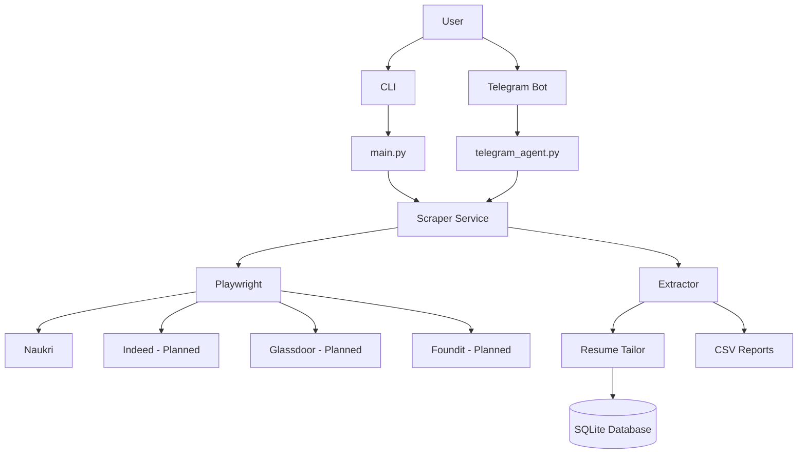

# Ghost Agent

## Overview
## Architecture



Ghost Agent is an AI-assisted **job discovery and application workflow automation**
platform. It scrapes job listings from supported platforms, uses a **locally-running
LLM** (via [Ollama](https://ollama.com)) to score how well each role fits your resume,
and then performs outreach to recruiters automatically via WhatsApp or email.

The agent can be driven from a **Telegram bot** or directly from the **command line**.
AI evaluation runs on your own machine, so your resume and job data never leave it —
no third-party AI API keys are required.

**Who it is for:** developers and job seekers who want to automate the repetitive parts
of job discovery (search, salary filtering, fit-scoring, contact extraction) while
keeping full control of their data and outreach.

> **Platform status:** Naukri is currently the only fully supported and actively maintained platform.
> Support for Glassdoor, Indeed, Foundit, and other job platforms is under development and may be partially implemented or non-functional in the current release.

## Features

- **Job scraping** with Playwright-driven, human-like browsing (random delays, popup
  dismissal, anti-automation flags).
- **Salary filtering** — skips listings below a minimum LPA you specify.
- **Local AI fit-scoring** via Ollama so your data never leaves your machine.
- **Outreach waterfall** — sends a WhatsApp message when a phone number is available,
  and falls back to email when only an email address is found.
- **Two usage modes** — a CLI (`main.py`) and a Telegram bot (`telegram_agent.py`).
  Telegram is optional; you can use the whole project without it.
- **Lead persistence** in a local SQLite database with de-duplication and a per-lead
  status column.
- **CSV export** of all stored leads to `data/leads.csv` for manual review.
- **Persistent logging** to both the console and `logs/ghost_agent.log`.
- **Cross-platform** — works on Windows, Linux, and macOS.

## Current Platform Support

| Platform  | Status         |
| --------- | -------------- |
| Naukri    | Supported      |
| Glassdoor | Pending Update |
| Indeed    | Pending Update |
| Foundit   | Pending Update |

Naukri is currently the only fully supported and actively maintained platform.
Support for Glassdoor, Indeed, Foundit, and other job platforms is under development
and may be partially implemented or non-functional in the current release.

## Screenshots

No screenshots are bundled with the repository, because screenshots of job sites and
messaging apps would contain personal data. To add your own screenshots for your fork:

1. Place image files in an `assets/` directory (not committed by default).
2. Reference them here, e.g. ``.
3. Ensure every screenshot is free of personal data, cookies, or credentials before
   committing (`.gitignore` blocks common image types by default — use
   `git add -f assets/your-image.png` to force-add a verified-safe image).

Suggested screenshots to capture from your own runs: the CLI startup banner, a
Telegram `/hunt` conversation, and the generated `data/leads.csv` opened in a
spreadsheet.

## Architecture

```
ghost_agent/
├── main.py                 # CLI entry point: scrape -> score -> outreach -> export
├── telegram_agent.py       # Telegram bot entry point (drives main.py as a subprocess)
├── run_saved_numbers.py     # Re-engage previously saved leads
├── core/
│   ├── config.py           # Paths, env loading, centralized logging, browser launch opts
│   └── database.py         # SQLite schema, lead CRUD, de-dup, CSV export
├── services/
│   ├── scraper.py          # Playwright job scraper + salary/phone/email parsers
│   ├── messenger_agent.py  # AI scoring (Ollama) + WhatsApp/email outreach waterfall
│   ├── resume_tailor.py    # Reserved for future resume-tailoring logic
│   └── extractor.py        # Reserved for future structured-contact extraction
├── data/
│   └── master_resume.txt   # Your resume (sample placeholder provided)
├── scripts/                # Per-OS setup & run helpers
│   ├── setup_windows.bat / run_windows.bat
│   ├── setup_linux.sh   / run_linux.sh
│   └── setup_mac.sh     / run_mac.sh
├── Makefile                # make setup | cli | telegram | export | clean (Linux/macOS)
└── requirements.txt
```

**Workflow / data flow:**

1. **Scrape** — `scraper.py` opens a persistent browser profile, paginates listings,
   skips low-salary cards, navigates into each job, and extracts a phone/email contact.
2. **De-duplicate** — each candidate lead is checked against the SQLite DB (by id, phone,
   and email) before any work is done.
3. **Score** — `messenger_agent.score_job_alignment()` asks the local Ollama model to
   rate the job against your resume (1–10) and to explain its reasoning.
4. **Store** — leads scoring `>= 5` are inserted into SQLite.
5. **Outreach** — `deploy_outreach_loop()` sends a WhatsApp message; if no phone number
   is available (or the number is invalid on WhatsApp), it falls back to email.
6. **Export** — the leads table is exported to `data/leads.csv` for manual review, and
   everything is logged to `logs/ghost_agent.log`.

**Storage:**

- **SQLite DB** — `core/ghost_protocol.db` is the source of truth for stored leads.
- **CSV export** — `data/leads.csv` is a human-readable dump of the DB.
- **Browser profiles** — `data/web_session/{platform}_profile` and
  `data/web_session/whatsapp_profile` hold login sessions.
- **Resume** — `data/master_resume.txt` is read at runtime.

All of the above (except the included placeholder `data/master_resume.txt`) are
git-ignored and never committed.

## Requirements

- **Python** 3.10 or newer.
- **Operating system:** Windows, Linux, or macOS.
- **[Ollama](https://ollama.com)** installed and running locally. Pull the default
  model once:
  ```bash
  ollama pull llama3.2:3b
  ```
- **Playwright** browser: bundled Chromium is installed automatically by the setup
  scripts (`playwright install chromium`).
- **Google Chrome / Edge** (optional). Set `BROWSER_CHANNEL=chrome` or `msedge` to use
  an installed browser instead of bundled Chromium.
- **Telegram** (optional, only for bot mode): a bot token from `@BotFather`.
- **SMTP** (optional, only for the email outreach fallback): a sender email and an
  app password.

No third-party AI API keys are required.

## Installation

### Windows
```cmd
git clone <REPOSITORY_URL>
cd ghost_agent
scripts\setup_windows.bat
```
The script creates a `ghost_env\` virtual environment, installs Python dependencies,
installs the Playwright Chromium browser, and copies `.env.example` to `.env`.

### Linux
```bash
git clone <REPOSITORY_URL>
cd ghost_agent
chmod +x scripts/*.sh
./scripts/setup_linux.sh
```
On Debian/Ubuntu the script also installs Playwright's system dependencies via `sudo`.

### macOS
```bash
git clone <REPOSITORY_URL>
cd ghost_agent
chmod +x scripts/*.sh
./scripts/setup_mac.sh
```

### One-command (Linux / macOS)
```bash
make setup
```

### Manual installation (any OS)
```bash
python3 -m venv ghost_env          # Windows: python -m venv ghost_env
source ghost_env/bin/activate      # Windows: ghost_env\Scripts\activate.bat
pip install -r requirements.txt
playwright install chromium       # Linux: also run: sudo playwright install-deps chromium
cp .env.example .env              # Windows: copy .env.example .env
ollama pull llama3.2:3b           # AI model used for fit-scoring
```

## Quick Start

### Quick Start — CLI (no Telegram needed)

```bash
git clone <REPOSITORY_URL>
cd ghost_agent
python3 -m venv .venv
source .venv/bin/activate          # Windows: .venv\Scripts\activate.bat
pip install -r requirements.txt
playwright install chromium
ollama pull llama3.2:3b
cp .env.example .env               # optional for CLI-only usage
# put your resume at data/master_resume.txt (replace the placeholder)
python main.py                     # interactive prompts, or pass flags:
python main.py --keyword "L2 Application Support" --location Hyderabad \
               --min_salary 6.0 --sites naukri --count 10
```

To re-export previously stored leads to CSV without scraping:
```bash
python main.py --export
```

### Quick Start — Telegram bot

1. Create a Telegram bot:
   - In Telegram, open **@BotFather**, send `/newbot`, and follow the prompts.
   - Copy the bot token it gives you (e.g. `123456789:ABC-DEF...`).
2. Configure the token:
   ```bash
   cp .env.example .env
   # edit .env and set TELEGRAM_BOT_TOKEN=your_token_here
   ```
3. Run the bot:
   ```bash
   python telegram_agent.py        # or: make telegram  /  ./scripts/run_linux.sh
   ```
4. In Telegram, send `/start` (or `/hunt`) to your bot and answer the prompts:
   role, location, minimum salary (LPA), sites, and jobs-per-site count.
5. Live logs stream back to the chat. Send `/stop` to cancel a running hunt, or
   `/cancel` to abort configuration.

## Configuration

All configuration lives in `.env` (never committed). Copy `.env.example` and edit it.
A full reference is also shown in `sample_config.json`.

| Variable              | Required for        | Default                              | Description                                      |
| --------------------- | ------------------- | ------------------------------------ | ------------------------------------------------ |
| `TELEGRAM_BOT_TOKEN`  | Telegram bot mode   | —                                    | Token from `@BotFather`                          |
| `TELEGRAM_CHAT_ID`    | Telegram bot mode   | —                                    | Chat id / bot username for notifications         |
| `SMTP_EMAIL`          | Email fallback      | —                                    | Sender email address                             |
| `SMTP_PASSWORD`       | Email fallback      | —                                    | App password (use an app password, not your login) |
| `SMTP_HOST`           | Email fallback      | `smtp.gmail.com`                     | SMTP host                                         |
| `SMTP_PORT`           | Email fallback      | `587`                                | SMTP port                                         |
| `OLLAMA_URL`          | AI scoring           | `http://localhost:11434/api/generate`| Ollama endpoint                                   |
| `MODEL_NAME`          | AI scoring           | `llama3.2:3b`                        | Ollama model name                                 |
| `BROWSER_CHANNEL`     | Optional            | *(empty = bundled Chromium)*         | `chrome` / `msedge` / empty                       |
| `HEADLESS`            | Optional            | `false`                              | `true`/`false` (first run needs a visible window) |

Put your resume at **`data/master_resume.txt`**. A fictional placeholder is included —
replace it with your own. See `sample_resume.txt`, `sample_cover_letter.txt`,
`sample_leads.csv`, and `sample_config.json` for safe example data.

## Usage

### CLI mode (no Telegram)

```bash
# Linux/macOS
source ghost_env/bin/activate
python main.py --keyword "L2 Application Support" --location Hyderabad \
               --min_salary 6.0 --sites naukri --count 10

# Windows
ghost_env\Scripts\activate.bat
python main.py --keyword "L2 Application Support" --location Hyderabad ^
               --min_salary 6.0 --sites naukri --count 10
```

Flags:

| Flag            | Description                                          |
| --------------- | ---------------------------------------------------- |
| `--keyword`     | Job role / search keyword                            |
| `--location`    | Target location                                       |
| `--min_salary`  | Minimum salary in LPA (e.g. `6.0`)                    |
| `--sites`       | `naukri`, `glassdoor`, `indeed`, `foundit`, or `all` |
| `--count`       | Jobs to scan per site                                 |
| `--interactive` | Force guided prompts for every option                |
| `--export`      | Export stored leads to `data/leads.csv` and exit     |

Without arguments the CLI prompts interactively for each option.

### Telegram bot mode

1. Configure `.env` with a valid `TELEGRAM_BOT_TOKEN`.
2. Run the agent:
   - Linux/macOS: `./scripts/run_linux.sh` / `./scripts/run_mac.sh` / `make telegram`
   - Windows: `scripts\run_windows.bat`
3. In Telegram, send `/hunt` and answer the prompts (role, location, salary, sites,
   count). Live logs stream back to the chat. Send `/stop` to cancel a run.

**Supported bot commands:**

| Command   | Description                                            |
| --------- | ----------------------------------------------------- |
| `/start`  | (or any text) greet the bot                           |
| `/hunt`   | Start a guided job-search campaign                    |
| `/stop`   | Emergency-stop the currently running hunt & browsers   |
| `/cancel` | Abort the configuration conversation                   |

### Re-engage saved leads

```bash
python run_saved_numbers.py
```
This re-runs outreach for every lead stored in the local database and re-exports
`data/leads.csv`.

### Headless / server Linux

The first run needs a **visible** browser window so you can log in to the job site
and scan the WhatsApp Web QR code. On a headless server, either run behind `xvfb`
(`xvfb-run python main.py ...`), or run once on a desktop machine (which saves the
session profile) and then set `HEADLESS=true`.

## Output Locations

A user must always know where collected data is stored. Ghost Agent writes to these
locations (all git-ignored, except the committed placeholder `data/master_resume.txt`):

| Data                | Location                        | Format | Purpose                                                      |
| ------------------- | ------------------------------- | ------ | ------------------------------------------------------------ |
| Leads (export)      | `data/leads.csv`                | CSV    | Human-readable export of all stored leads for manual review |
| Leads (source)      | `core/ghost_protocol.db`        | SQLite | Source of truth; powers de-duplication and status tracking   |
| Resume              | `data/master_resume.txt`        | Text   | Your resume, read at runtime (replace the placeholder)       |
| Browser sessions    | `data/web_session/`             | Files  | Persistent login profiles per platform + WhatsApp            |
| Tailored outputs    | `data/tailored_outputs/`        | Files  | Reserved for future resume-tailoring output                  |
| Logs                | `logs/ghost_agent.log`          | Log    | Persistent run log (also streamed to console)                |

How to inspect manually:

- **`data/leads.csv`** — open in any spreadsheet app, or `cat data/leads.csv`.
- **`core/ghost_protocol.db`** — `sqlite3 core/ghost_protocol.db "SELECT * FROM leads;"`
- **`logs/ghost_agent.log`** — `tail -n 200 logs/ghost_agent.log`.

### Manual Verification

After a run completes (`python main.py --export`), inspect `data/leads.csv`.
Each row records what was collected per lead:

| Field      | Stored in            | Example (fake)                                   |
| ---------- | -------------------- | ------------------------------------------------ |
| `id`       | `data/leads.csv`     | `naukri_0_919876543210`                          |
| `company`  | `data/leads.csv`     | `Example Company A`                              |
| `title`    | `data/leads.csv`     | `L2 Application Support`                         |
| `phone`    | `data/leads.csv`     | `919876543210` (Indian format, country-prefixed) |
| `email`    | `data/leads.csv`     | `recruiter1@example.com`                         |
| `url`      | `data/leads.csv`     | `https://www.naukri.com/example-job-listing`     |
| `status`   | `data/leads.csv`     | `NEW` / `CONTACTED` / `RECONTACTED`              |

Sample `data/leads.csv` (also see `sample_leads.csv`):

```csv
id,company,title,phone,email,url,status
naukri_0_919876543210,Example Company A,L2 Application Support,919876543210,recruiter1@example.com,https://www.naukri.com/example-job-listing,CONTACTED
naukri_1_recruiter2@example.com,Example Company B,Application Engineer,,recruiter2@example.com,https://www.naukri.com/example-job-listing,CONTACTED
naukri_2_919876000003,Example Company C,Support Analyst,919876000003,,https://www.naukri.com/example-job-listing,NEW
```

The full DB schema (`core/ghost_protocol.db` → table `leads`) also tracks
`human_intervention_required`, `created_at`, and `updated_at`.

## Troubleshooting

| Symptom                                             | Fix                                                                 |
| --------------------------------------------------- | ------------------------------------------------------------------- |
| `[-] TELEGRAM_BOT_TOKEN is missing`                 | Copy `.env.example` to `.env` and add your token. CLI mode needs no token. |
| `[-] Could not find data/master_resume.txt`         | Create it (copy `sample_resume.txt` and edit).                     |
| Scraper opens but finds 0 listings                  | The site's login wall or DOM changed; log in once in the visible browser window, then re-run. |
| WhatsApp outreach times out                          | Scan the WhatsApp Web QR code once in the visible browser window.  |
| `Connection refused` to `localhost:11434` (AI)      | Start the Ollama app and run `ollama pull llama3.2:3b`.             |
| AI gives a low/rough score                            | Small local models are approximate; try a larger model via `MODEL_NAME`. |
| Email fallback skipped: "Credentials missing"        | Set `SMTP_EMAIL` and `SMTP_PASSWORD` (an app password) in `.env`.   |
| Headless server won't log in / scan QR               | Run once on a desktop (saves the session), or use `xvfb-run`.        |
| `playwright` command not found after install         | Activate the virtual environment: `source ghost_env/bin/activate`.  |
| Linux Chromium missing system libraries              | Run `sudo playwright install-deps chromium`.                          |

## Security

- **Secrets** live only in your local, git-ignored `.env`. Never commit them.
- **Browser profiles, databases, and logs** are git-ignored. They contain cookies and
  session data and must never be shared or committed.
- **AI is local.** Resume and job data is processed by a local Ollama model and is not
  sent to any external AI provider.
- If you ever commit a secret by accident, **rotate it immediately** — removal alone is
  not enough. Assume it is compromised.
- See [SECURITY.md](./SECURITY.md) for the vulnerability reporting policy.
- Use this tool **responsibly** and in compliance with each platform's Terms of Service
  and all applicable laws. Automated outreach may violate platform terms; misuse is the
  sole responsibility of the user.

## Limitations

- Only **Naukri** is fully supported today; other platforms are experimental and may be
  non-functional.
- Scrapers depend on the live DOM of each job site and will break when those sites change.
- WhatsApp outreach requires a one-time manual QR-code login per browser profile.
- AI scoring quality depends on the locally installed Ollama model — small models give
  rough scores.
- Outreach pacing includes fixed delays to reduce blocking risk; high-volume automated
  messaging is not endorsed and may violate platform terms.

## Roadmap

- [ ] Complete and stabilize Glassdoor support.
- [ ] Complete and stabilize Indeed support.
- [ ] Complete and stabilize Foundit support.
- [ ] Implement `services/resume_tailor.py` (auto-tailored resumes per role).
- [ ] Implement `services/extractor.py` (structured contact extraction).
- [ ] Separate recruiter / application tracking tables and exports.
- [ ] Pluggable outreach channels beyond WhatsApp/email.
- [ ] Better anti-detection and CAPTCHA handling.
- [ ] Improved onboarding and automated setup validation.

## Contributing

Contributions are welcome. Please read [CONTRIBUTING.md](./CONTRIBUTING.md) before
opening a pull request, and never commit secrets or personal data. All participants are
expected to follow the [Code of Conduct](./CODE_OF_CONDUCT.md).

